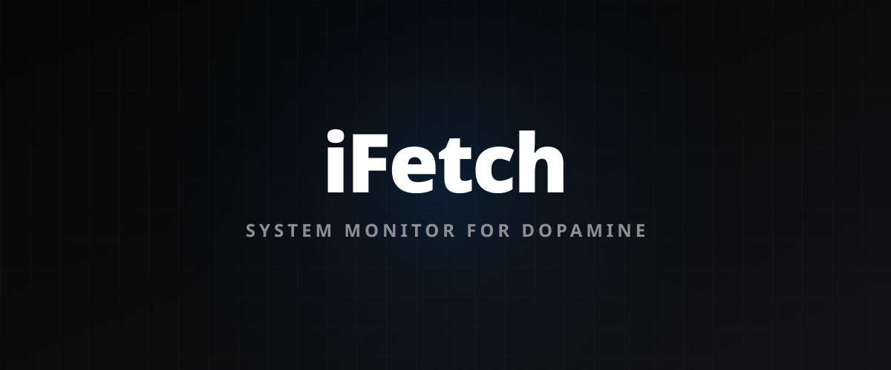
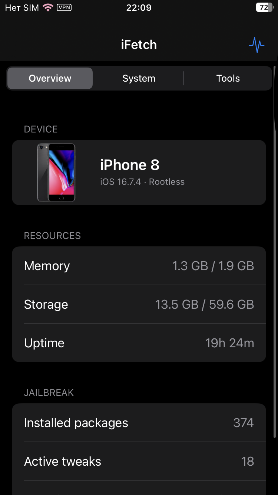
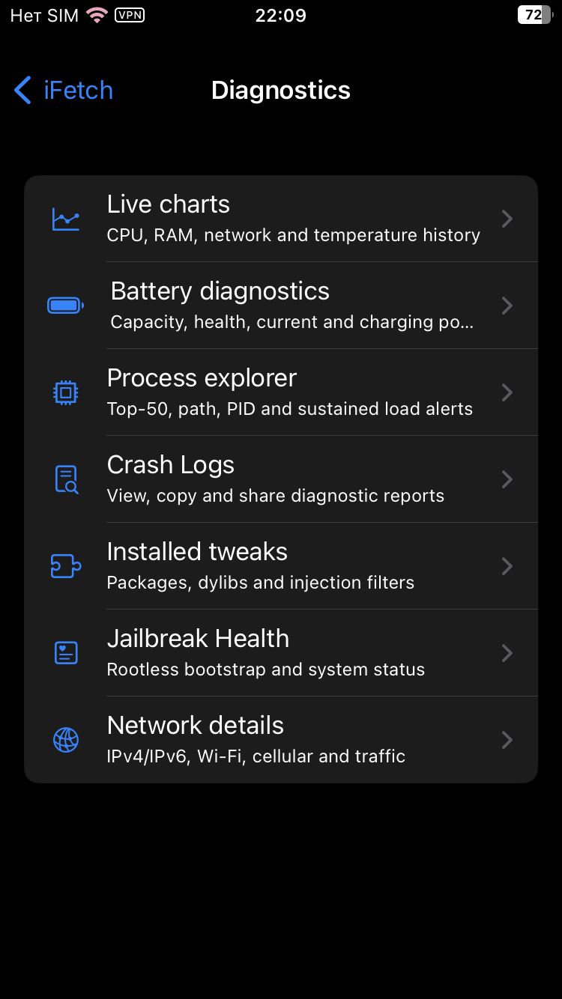

<div align="center">
  
</div>

<div align="center">
  <strong>English</strong> · <a href="README_RU.md">Русский</a>
</div>

# iFetch

[](https://github.com/weekanya/iFetch/actions/workflows/build-artifact.yml)

iFetch is a system diagnostics app for iPhones running a rootless jailbreak on
iOS 14–17. It includes a native Swift UIKit app, Home Screen widgets, a Control
Center module, and the `ifetch` command for NewTerm and SSH.

<div align="center">
  
  
</div>

## Features

- live CPU, memory, storage, battery, temperature, and network monitoring;
- Swift interface with an iOS 18-inspired visual style;
- process explorer with tweak details and confirmed process termination;
- per-process sockets, Wi-Fi, DNS, VPN, traffic speed, and latency information;
- crash analysis, injection map, LaunchDaemons, and jailbreak integrity checks;
- system snapshots, health notifications, and a reversible diagnostic mode;
- dark small, medium, and large WidgetKit widgets with automatic refresh;
- live 3×2 CCSupport dashboard for Control Center;
- manual widget cache refresh and rootless-safe privileged operations;
- English and Russian interface.

## Install

Add the repository to Sileo and install **iFetch**:

```text
https://weekanya.github.io/iFetch/
```

Only rootless jailbreaks are supported. The package architecture is
`iphoneos-arm64`, with iOS 14.0 as the minimum deployment target.

## Terminal

Run `ifetch` in NewTerm or over SSH. Useful options include:

```sh
ifetch --watch
ifetch --json
ifetch --processes 10
ifetch --network
ifetch --battery
ifetch --lang ru
```

## Build

Local builds require Theos, Swift 5.8, and the iOS 16.5 SDK or newer:

```sh
make -C src clean package FINALPACKAGE=1
```

Alternatively, use
[Build Rootless Artifact](https://github.com/weekanya/iFetch/actions/workflows/build-artifact.yml)
to build the project directly on GitHub.

## Privacy

System information is collected locally. iFetch contacts `api.ipify.org` only
to determine the public IP address.

## License

MIT. See [LICENSE](LICENSE).
