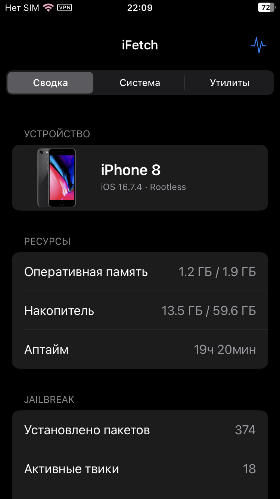
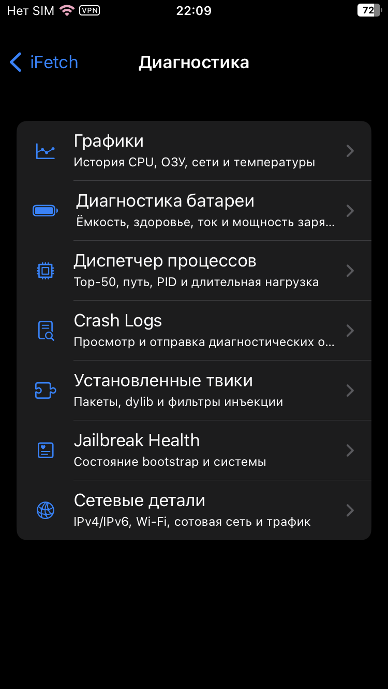

<div align="center">
  
</div>

<div align="center">
  <a href="README.md">English</a> · <strong>Русский</strong>
</div>

# iFetch

iFetch — набор диагностических инструментов для iPhone с rootless-джейлбрейком
на iOS 14–17. В нём есть системный дашборд, диспетчер процессов, просмотр
crash-логов, информация о твиках, модуль Control Center и консольная команда.
В версии 3.1 также появились настоящие виджеты WidgetKit малого, среднего и
большого размера.

Интерфейс сделан на UIKit и выглядит как обычный раздел настроек iOS. Вместе с
приложением устанавливается консольная команда `ifetch` для NewTerm и SSH.

По умолчанию используется английский язык. В разделе
`Tools → Settings → Language` можно выбрать русский. Выбор сохраняется для
приложения и консольной команды.

<div align="center">
  
  
</div>

## Системная информация

- модель iPhone, идентификатор, чип, архитектура и версия Darwin;
- использование оперативной памяти и накопителя;
- здоровье, фактическая и проектная ёмкость, температура, напряжение, ток,
  мощность зарядки и количество циклов аккумулятора;
- аптайм и термостатус устройства;
- графики CPU, ОЗУ, сети, заряда и температуры;
- диспетчер процессов с PID, путём, потоками, временем работы и внедряемыми
  твиками, а также завершением процесса после подтверждения;
- скорость загрузки и отдачи в реальном времени;
- IPv4/IPv6, локальный и публичный IP, DNS, Wi-Fi, тип сотовой сети, VPN,
  трафик по интерфейсам и задержка;
- jailbreak-окружение и установленный хук-инжектор;
- проверка Jailbreak Health с предупреждениями и переходом к деталям сбоев;
- поиск по установленным твикам, версиям пакетов и фильтрам инъекции;
- просмотр, копирование и отправка crash-логов.
- виджеты домашнего экрана с зарядом, ОЗУ, хранилищем, аптаймом, сбоями и
  самым прожорливым по памяти процессом.

iFetch распознаёт ElleKit, Cydia Substrate, libhooker и Substitute. Поддержаны
модели от iPhone 6s до iPhone 15 Pro Max; для каждой модели используется своё
изображение.

## Системные действия

Из приложения можно выполнить:

- Respring;
- обновление кэша иконок;
- переход в Safe Mode;
- Userspace Reboot;
- копирование полного или приватного системного отчёта со скрытыми IP-адресами.

Действия, которые могут прервать текущую сессию, требуют подтверждения. Если
системная команда отсутствует или завершается с ошибкой, iFetch сообщает об
этом.

## Команда `ifetch`

Откройте NewTerm или подключитесь к устройству по SSH:

```sh
ifetch
```

Команда выводит ASCII-логотип и информацию об устройстве, jailbreak, сети,
батарее, памяти, накопителе и процессах. Для мониторинга и скриптов доступны:

```sh
ifetch --watch
ifetch --json
ifetch --processes 10
ifetch --network
ifetch --battery
ifetch --lang ru
ifetch --no-color
```

## Виджеты и Control Center

В версии 3.1 добавлено нативное расширение WidgetKit с тремя размерами.
Обновлённый модуль Control Center 2×2 показывает CPU, ОЗУ, скорость сети и
температуру батареи. Для модуля Control Center требуется CCSupport.

## Совместимость

- iOS 14–17;
- rootless jailbreak;
- архитектура пакета `iphoneos-arm64`;
- минимальная версия сборки — iOS 14.0.

Бинарник использует совместимый срез `arm64` и работает в том числе на
устройствах с аппаратной архитектурой `arm64e`.

## Сборка

Для сборки нужны Theos, Swift 5.8 и iOS SDK 16.5 или новее:

```sh
make -C src clean package FINALPACKAGE=1
```

Готовый пакет появится по адресу:

```text
packages/com.wee1ka.ifetch_3.1.1_iphoneos-arm64.deb
```

Проверка проекта:

```sh
src/scripts/validate_project.sh
```

Пересоздание обрезанных изображений устройств с помощью ImageMagick 7:

```sh
src/scripts/process_device_atlases.sh
```

## Доступ к системе и приватность

iFetch рассчитан на jailbreak-окружение и подписывается с расширенными
entitlements. Они нужны для чтения процессов, данных аккумулятора и другой
системной статистики.

Почти вся информация собирается локально. Для определения публичного IP
выполняется один HTTPS-запрос к `api.ipify.org`. Если сервис недоступен,
отображается `Недоступно`.

## Структура исходного кода

- `src/app` — приложение UIKit и его экраны;
- `src/core` — общая логика мониторинга и диагностики;
- `src/cli` — консольная версия;
- `src/control-center` — модуль CCSupport;
- `src/widgets` — расширение WidgetKit и сбор системных показателей;
- `src/resources` — ресурсы приложения, локализация, каталог и изображения устройств;
- `src/packaging` — entitlements и метаданные модуля Control Center;
- `src/artwork` — исходные атласы устройств;
- `src/scripts` — проверка проекта и обработка изображений;
- `docs/releases` — описания выпусков;
- `repo` — исходные файлы репозитория Sileo;

В каталоге `src` также находятся `Makefile` Theos и файл пакета `control`,
поэтому всё, что относится к приложению, собрано в одном месте.

## Лицензия

MIT. Подробнее — в файле [LICENSE](LICENSE).
